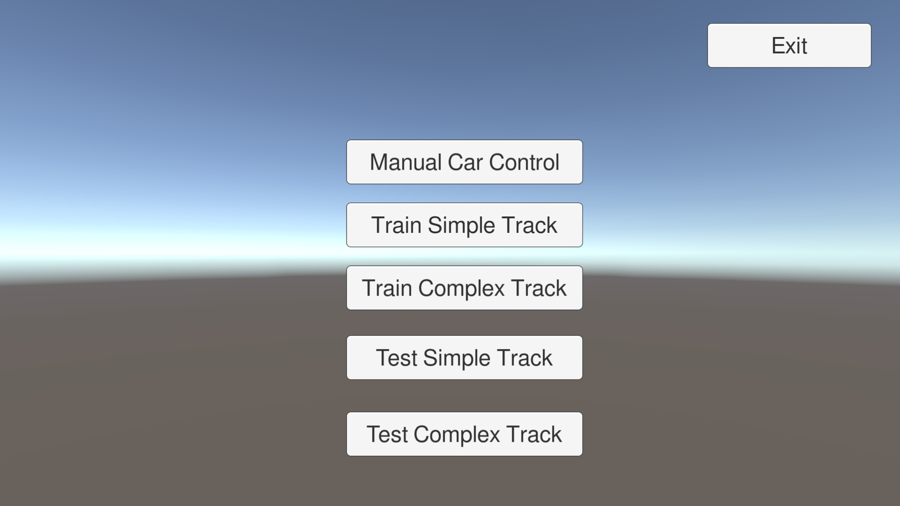

# Autonomous-Driving-Vehicle

## Overview

Neural Network is trained using evolutionary mechanism in reinforcement environment. The neural network has 5 nodes 
in input layer each one for sensor and 2 nodes in output layer for forward motion and steering. Population of 10 is created, 
each individual performs activities for 60 secs. Then fitness is calculated and 5 individuals with lower fitness are mutated randomly.  

## Dependencies

- Unity 3D Game Engine

Required to edit the project.

## Demo Step

There are no dependencies to run the demo.

Windows: -
```
Open output/Windows folder
Double click on Autonomous-Driving-Vehicle.exe
```

Linux: -
```
Open output/Linux folder
Run command:- chmod +x Autonomous-Driving-Vehicle.x86_64
Double click on Autonomous-Driving-Vehicle.x86_64
```



- Manual Car Control: - Opens a scene where car can be manually driven.
- Train Simple Track: - Trains car on simple track (models are stored at Output/"OS"/Autonomous-Driving-Vehicle_Data/NeuralNetworkModels).
- Train Complex Track: - Trains car on complex track (models are stored at Output/"OS"/Autonomous-Driving-Vehicle_Data/NeuralNetworkModels).
- Test Simple Track: - Loads pre trained model and runs it on simple track (track is unknown to the network).
- Test Complex Track: - Loads pre trained model and runs it on complex track (track is known to the network).

## Results


Demo video [link](https://youtu.be/dWk-vWELtQw)
